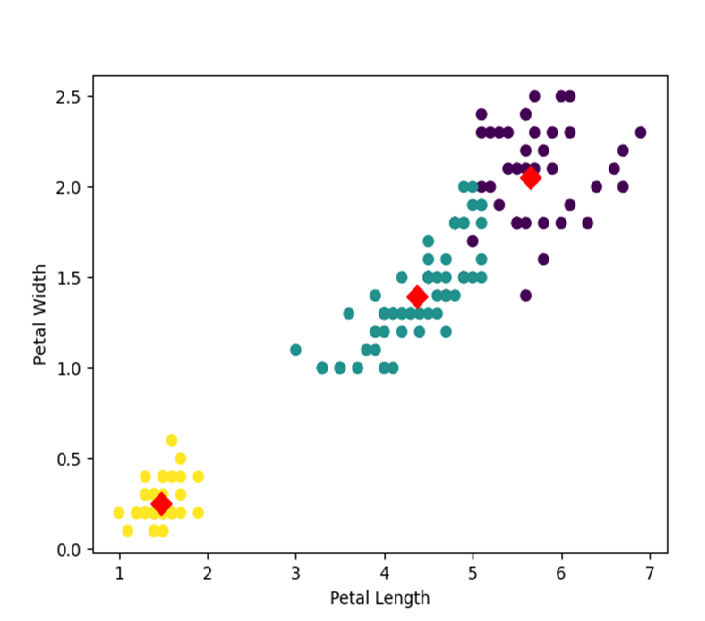
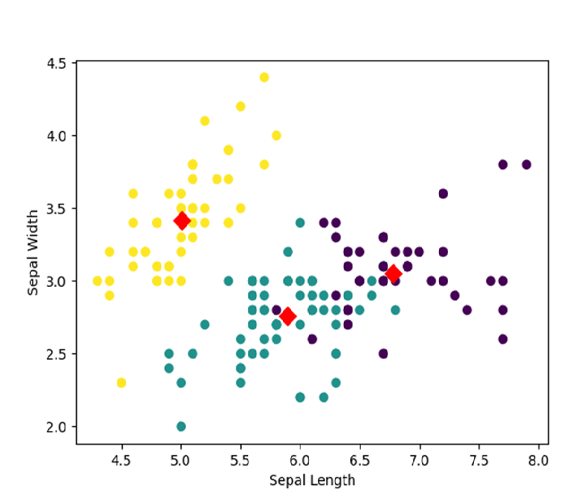

# 📖Fuzzy C-Means Clustering on Iris Dataset

This repository presents a **Python implementation of the Fuzzy C-Means (FCM) clustering algorithm** applied to the classic Iris dataset. Fuzzy C-Means is a soft clustering method where each data point can belong to multiple clusters with varying degrees of membership. This project demonstrates how to implement FCM from scratch, visualize clustering results, and evaluate performance using the **Calinski-Harabasz Index**.
The implementation is fully modular and easy to adapt for other datasets or experiments. The repository includes helper functions, scripts for running the algorithm, and visualization tools for exploring the clustering outcomes.

---

## 💡Features

- Fuzzy C-Means algorithm implemented from scratch in Python
- Soft clustering with membership values
- Visualizations of clusters for Sepal and Petal dimensions
- Performance evaluation using Calinski-Harabasz score
- Clean, well-documented, and modular code for easy adaptation

The Iris dataset is a classic dataset in machine learning and consists of 150 samples of iris flowers, each with four features (sepal length, sepal width, petal length,and petal width) and a target label indicating the species of iris.
Our goal is to cluster the samples into different groups based on these features.
 
✨Star if you find it useful

 

  
  
   

